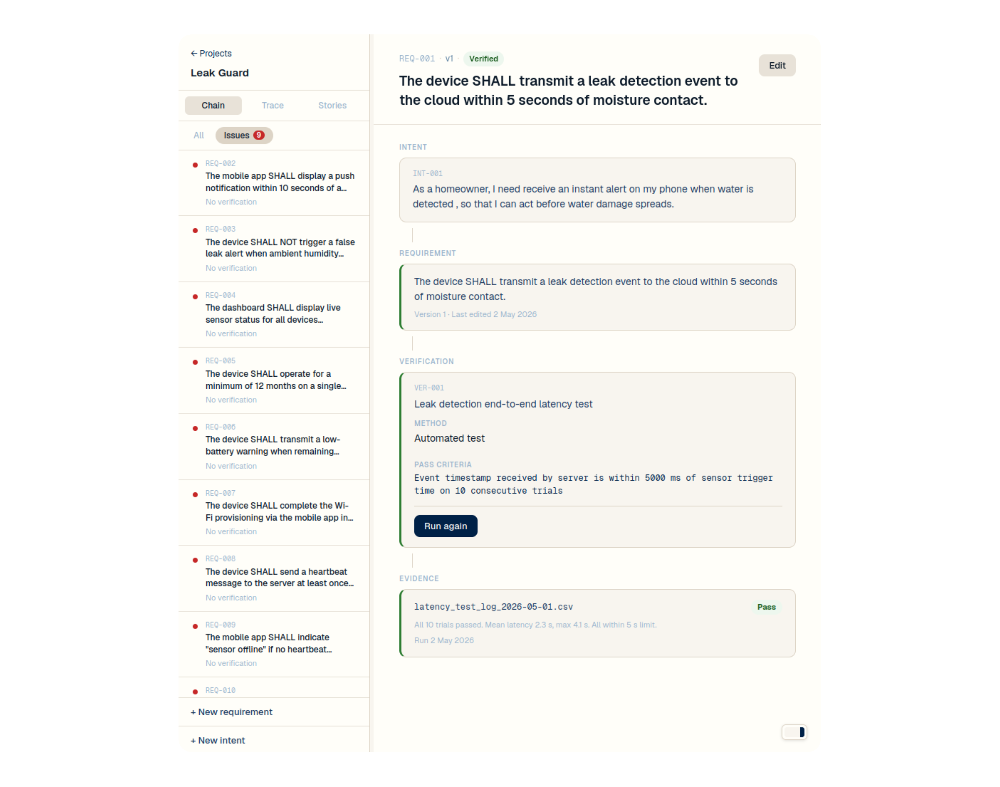
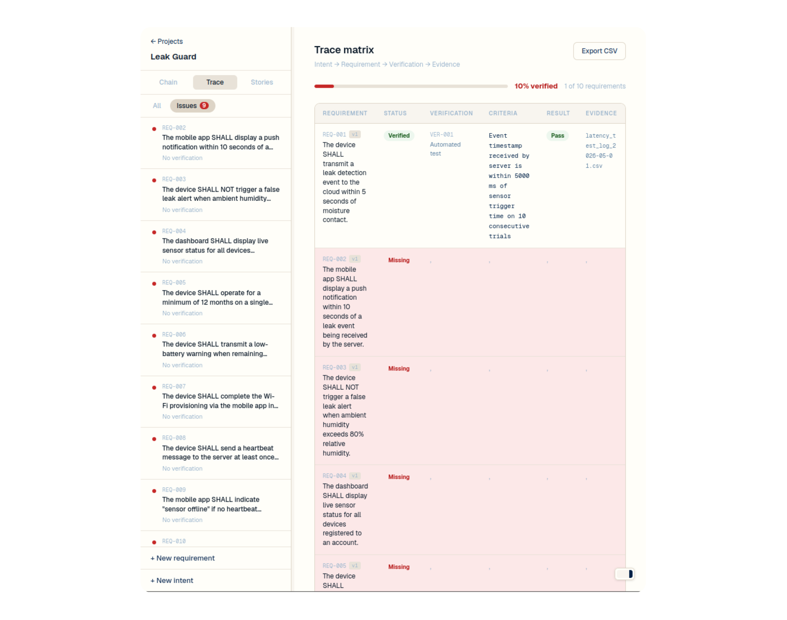
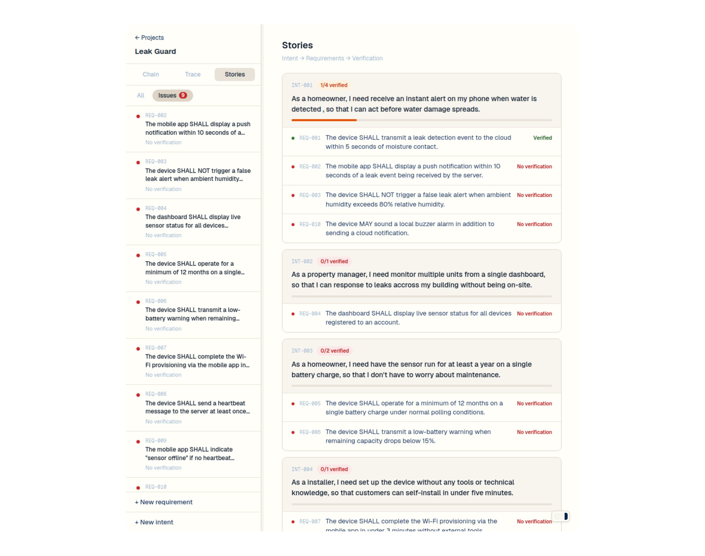

# Tracer

Local, offline requirements tracing for small engineering projects.

Tracer keeps the verification chain intact: intent, requirement, verification, evidence. 

Edit a requirement and the verification that relied on the old version is immediately marked stale.


## Quick Start

```bash
docker run --rm \
  -p 127.0.0.1:3000:3000 \
  -v tracer-data:/data \
  ghcr.io/finorr/tracer:latest
```

Open `http://localhost:3000`.

The first image pull requires internet access. After that, the app runs locally and stores its data in the Docker volume mounted at `/data`.

## Data

Tracer stores everything in SQLite at `/data/tracer.db` inside the container.

Back up the database:

```bash
docker run --rm \
  -v tracer-data:/data \
  -v "$PWD":/backup \
  busybox cp /data/tracer.db /backup/tracer.db
```

Reset local data:

```bash
docker volume rm tracer-data
```

## What It Tracks

Everything is an item: intent, requirement, verification, or risk. Evidence is recorded on verification runs.

Relationships can:

- `refine`: break intent into requirements
- `verify`: link a verification to what it must prove
- `mitigate`: connect a risk to its control

The app derives requirement status automatically:

- requirements without verification are unverified
- verifications without a run are stale
- editing a requirement makes its verification stale until re-run
- the trace matrix shows gaps across the project

## Screenshots

<table>
  <tr>
    <td></td>
    <td></td>
    <td></td>
  </tr>
  <tr>
    <td align="center">Requirement chain</td>
    <td align="center">Trace matrix</td>
    <td align="center">User stories</td>
  </tr>
</table>

## Local Development

Local development requires Node.js 24 or newer.

```bash
npm install
npm run dev
```

By default, development data is stored in `.data/tracer.db`. Override it with:

```bash
TRACER_DB_PATH=/path/to/tracer.db npm run dev
```

Useful checks:

```bash
npm run typecheck
npm run build
docker build -t tracer:local .
```

## Stack

- Next.js 14
- React 18
- SQLite via Node's built-in `node:sqlite`
- TypeScript

## License

[MIT](LICENSE)
